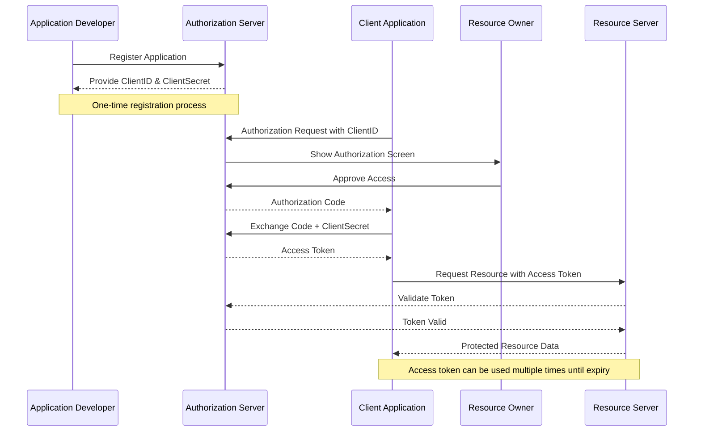
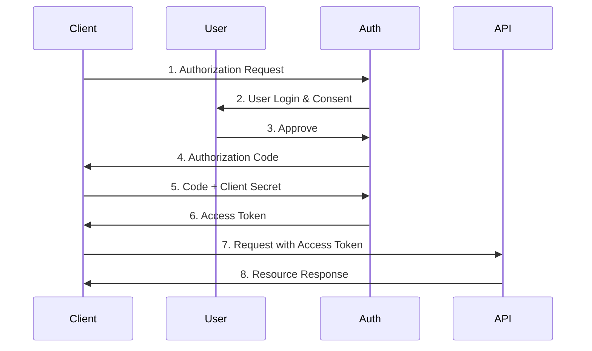
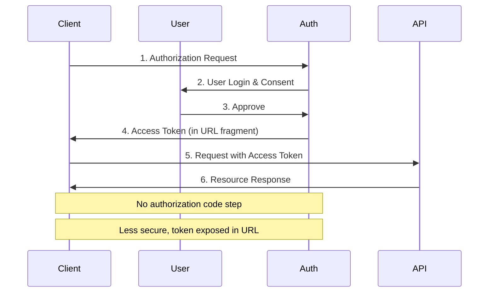
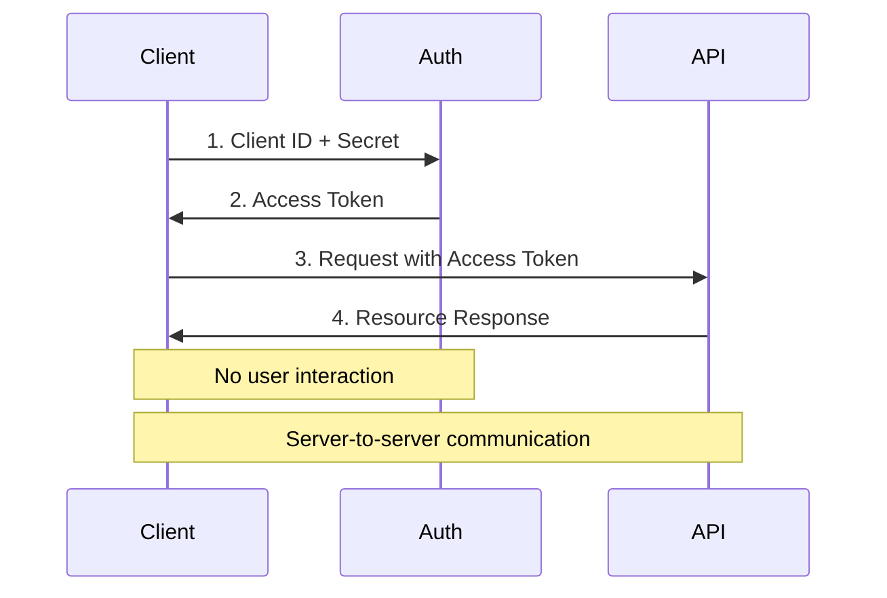
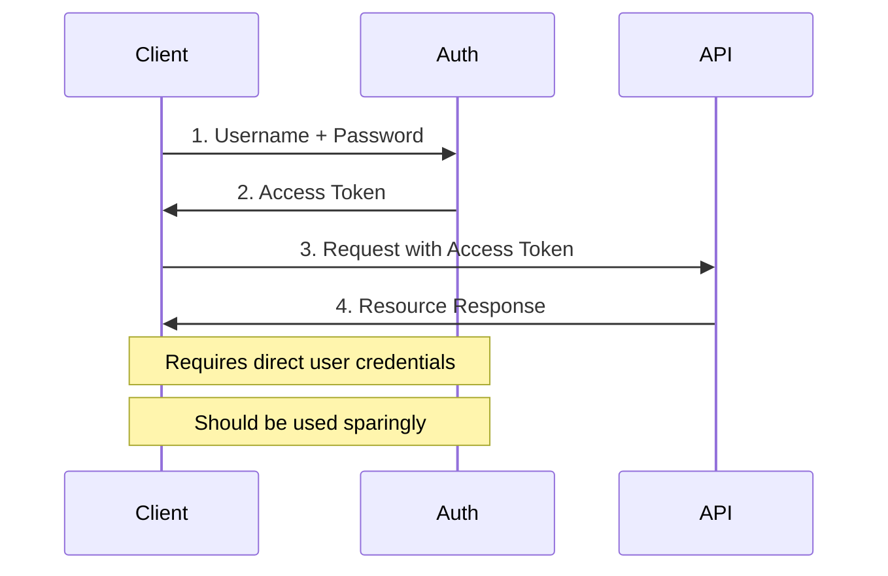

# Auth Service

## What is OAuth 2.0?

OAuth 2.0 (Open Authorization) is an industry-standard protocol for authorization that enables applications to obtain limited access to user accounts on other services. It provides secure delegated access to server resources on behalf of a resource owner. Instead of using the resource owner's credentials to access protected resources, OAuth allows applications to obtain an access token - a string that denotes a specific scope, lifetime, and other access attributes.

## Key Concepts

### Core Entities

1. **Resource Owner (User)**
   - The entity that owns the protected resources
   - Can grant access to their protected resources
   - Usually the end-user of the application

2. **Client Application**
   - The application requesting access to protected resources
   - Must be registered with the Authorization Server
   - Can be a web app, mobile app, or desktop application
   - Identified by Client ID and authenticated with Client Secret

3. **Authorization Server**
   - Issues access tokens to the client after authenticating the resource owner
   - Verifies the identity of the resource owner
   - Obtains authorization consent from the resource owner
   - Maintains:
     - Client registrations
     - User accounts
     - Consent decisions

4. **Resource Server**
   - Hosts the protected resources
   - Accepts and validates access tokens
   - Serves protected resources when presented with valid tokens
   - Often an API server

### Important Terms

1. **Access Token**
   - Credential used to access protected resources
   - Represents the authorization granted to the client
   - Has limited lifetime and scope
   - Sent with each API request

2. **Refresh Token**
   - Long-lived credential used to obtain new access tokens
   - Optional but commonly used
   - Must be stored securely
   - Never sent to resource servers

3. **Scope**
   - Defines the level of access granted
   - Specific permissions requested by the client
   - Examples: read_profile, write_posts, etc.

4. **Consent**
   - Explicit permission granted by the resource owner
   - Shows what permissions the app is requesting
   - Can be revoked at any time

## Application Registration

Before implementing OAuth, an application must be registered with the Authorization Server. This is a one-time setup process that involves:

1. **Basic Information**
   - Application name
   - Website URL
   - Logo/branding
   - Developer/Company information

2. **Technical Details**
   - Redirect URIs (callback URLs)
   - Application type (web, mobile, etc.)
   - API endpoints

3. **Credentials**
   - Client ID (public identifier)
   - Client Secret (confidential)
   
### Redirect URIs
- URLs where the authorization server redirects after authentication
- Must be pre-registered for security
- Should use HTTPS in production
- Must exactly match the URI used in authorization requests

## OAuth2 Flow Diagram

## Detailed Flow Explanation

1. **Application Registration**
   - Developer registers application with Authorization Server
   - Provides application name, website, logo, redirect URIs
   - Receives ClientID and ClientSecret

2. **Authorization Request**
   - Client initiates OAuth flow with Authorization Server
   - Uses ClientID to identify the application
   - User sees authorization screen

3. **User Approval**
   - User reviews permissions
   - Approves or denies access
   - Authorization Server redirects back to client with auth code

4. **Token Exchange**
   - Client exchanges authorization code + ClientSecret
   - Receives access token
   - Access token used for subsequent API calls

5. **Resource Access**
   - Client uses access token to request resources
   - Resource Server validates token with Auth Server
   - Returns protected resources if token is valid

## OAuth2 Grant Types

### 1. Authorization Code Grant
Best suited for server-side applications. Most secure flow as it involves backend exchange of tokens.

### 2. Implicit Grant
Optimized for browser-based applications where client secret can't be securely stored.

### 3. Client Credentials Grant
Used for machine-to-machine authentication where no user interaction is required.

### 4. Resource Owner Password Credentials
Direct username/password authentication. Only recommended for trusted first-party applications.

## Grant Types Comparison

| Feature | Authorization Code | Implicit Grant | Client Credentials | Password Credentials |
|---------|-------------------|----------------|-------------------|---------------------|
| Security Level | Highest | Medium | High | Medium |
| Refresh Tokens | Yes | No | No | Yes |
| Best For | Server-side apps | SPAs | Service-to-service | Trusted first-party apps |
| User Interaction | Yes | Yes | No | Yes |
| Token Exposure | No | Yes (URL) | No | No |
| PKCE Support | Yes | No | N/A | No |
| Complexity | High | Low | Low | Low |
| Recommended For New Apps | Yes | No* | Yes** | No |

\* Use Authorization Code with PKCE instead
\** Only for machine-to-machine communication